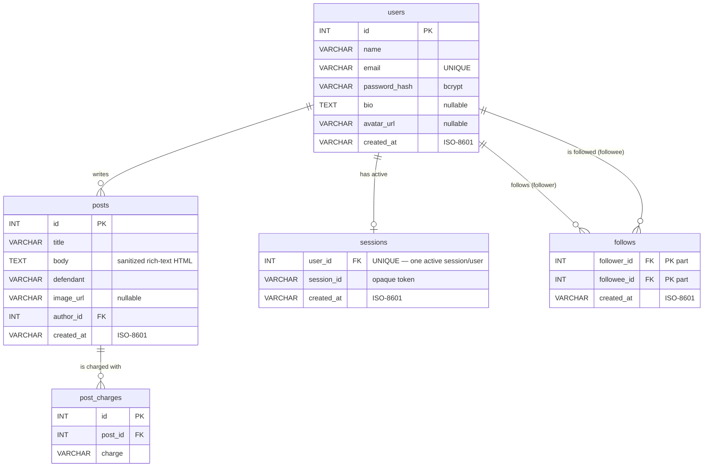

# LolSuit — Database Schema

MySQL 8 database (`lolsuit`, e.g. on Amazon RDS), created from [`init.sql`](init.sql) and seeded
from [`server/app/models.py`](../server/app/models.py). All tables are InnoDB / `utf8mb4`.

## Entity-Relationship Diagram

## Relationships

| From | To | Cardinality | Notes |
|---|---|---|---|
| `users` → `posts` | author | 1 — N | `posts.author_id` → `users.id`, `ON DELETE CASCADE` |
| `posts` → `post_charges` | charges | 1 — N | a post has zero or more charge labels |
| `users` → `sessions` | session | 1 — 1 | `sessions.user_id` is `UNIQUE`; a fresh login upserts the row |
| `users` ↔ `users` | follows | M — N | join table `follows(follower_id, followee_id)`; `CHECK (follower_id <> followee_id)` blocks self-follow |
