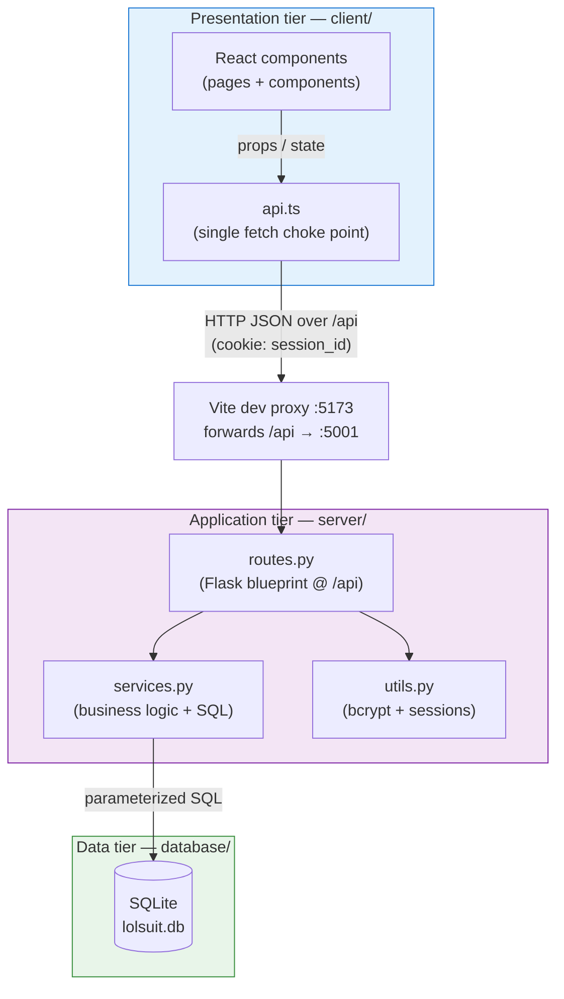

# LolSuit — Architecture Documentation ⚖️

> **What is this?** A guided tour of *how LolSuit actually works* — how a click in the
> React UI turns into a Flask route call, which runs a parameterized SQL query, and how the
> result flows back to the screen. If you want to **run** the app instead, see the root
> [README.md](../README.md).

LolSuit is a satirical social network — "the court of funny lawsuits" — where users file
humorous lawsuits against one another. It is a textbook **3-tier web architecture**: a
browser-side presentation tier, a stateless-HTTP application tier, and a persistent data
tier.

---

## The three tiers at a glance

| Tier | Responsibility | Technology | Lives in |
|---|---|---|---|
| **Presentation** | Render UI, hold view state, talk to the API | React 18 · TypeScript · Vite · MUI 5 (RTL/Hebrew) | [`client/`](../client/) |
| **Application** | HTTP routing, auth, business rules, SQL | Python · Flask · raw `sqlite3` (no ORM) | [`server/`](../server/) |
| **Data** | Persist & relate entities | SQLite | [`database/`](../database/) |

Each tier knows only about the tier directly beneath it. The browser never touches the
database; the database never calls out. All coupling happens at two well-defined seams:
the **HTTP/JSON boundary** (`/api`) and the **SQL boundary** (`server/app/services.py`).

---

## How the pieces connect

**The `/api` seam.** Every browser request goes through one module,
[`client/src/api.ts`](../client/src/api.ts) — components never call `fetch` directly. In
development the Vite dev server (`:5173`) proxies all `/api/*` calls to Flask (`:5001`), so
the browser sees a single same-origin app (see
[`client/vite.config.ts`](../client/vite.config.ts)). In production the same `/api` paths
are served by Flask directly.

**Cookie-based auth.** On login/signup the server sets an **httpOnly** `session_id` cookie.
JavaScript can't read it, which is the point — it can't be stolen by injected script. The
client opts every request into sending it with `credentials: "include"`. The server
resolves that cookie to a user on each request. See the
[application tier](application-tier.md) and [data-flow](data-flow.md) docs.

**The shared contract.** The TypeScript interfaces in
[`client/src/types.ts`](../client/src/types.ts) describe the *exact* JSON shapes that the
Python services in [`server/app/services.py`](../server/app/services.py) hand back. There is
no code generation — the two sides agree by convention, and the service functions are
written to match `types.ts` field-for-field (e.g. `Post`, `User`, `UserProfileResponse`).

---

## Documentation index

Read in this order for a top-to-bottom tour, or jump straight to a tier:

| Doc | What it teaches |
|---|---|
| 📱 [**presentation-tier.md**](presentation-tier.md) | The React frontend: provider stack, routing, state model, the `api.ts` layer, client-side validation & HTML sanitization. |
| ⚙️ [**application-tier.md**](application-tier.md) | The Flask backend: app factory, layered design, REST routing, bcrypt + stateful sessions, business rules, file uploads. |
| 🗄️ [**data-tier.md**](data-tier.md) | The SQLite database: connection helper, full schema walkthrough, bootstrap/seeding, and the parameterized-query patterns. |
| 🔁 [**data-flow.md**](data-flow.md) | End-to-end walkthroughs (login, feed load, filing a lawsuit) with sequence diagrams tracing a request through all three tiers. |

### See also
- 📦 Root [README.md](../README.md) — prerequisites and how to run both processes locally.
- 🧬 [database/schema.md](../database/schema.md) — the canonical ER diagram for the data model.
