# The database

MySQL 8, InnoDB, `utf8mb4` throughout (the UI is Hebrew). One file is the source of
truth: [`database/init.sql`](../database/init.sql), 24 tables. The three files in
[`prod/migrations/`](../prod/migrations/) are the deploy path for a database that already
has data, not a second source of truth.

---

## Conventions

- **Every timestamp is a `DATETIME` holding naive UTC**, written with `UTC_TIMESTAMP()`.
  There is exactly one clock: the database's. That is what lets the web process and the
  worker never disagree about whether a phase has ended.
- **Uniqueness that matters is enforced here**, not only in Python. Several of these
  UNIQUE keys *are* the crash-safety story (see [Invariants](#invariants-the-schema-itself-carries)).
- **No triggers, no stored procedures, no `DELIMITER` blocks.** The test suite executes
  this exact file against its own schema, so the tests exercise the real MySQL dialect —
  and a test asserts the file stays free of them.
- **The application never creates tables at boot.** `create_app()` has no side effects;
  the schema is applied by MySQL's own entrypoint from
  `/docker-entrypoint-initdb.d/01-init.sql`, and seeding is a separate one-shot process
  (`python -m app.seed`).
- `docker-entrypoint-initdb.d` **only runs on an empty data volume**. After editing
  `init.sql` you need `docker compose down -v && docker compose up -d`.
- Nothing is ever `DELETE`d for moderation. Hiding is a status transition.

---

## ER diagram

```mermaid
erDiagram
    users ||--o| agents : "user_id"
    users ||--o{ sessions : "user_id"
    users ||--o{ password_resets : "user_id"
    users ||--o{ cases : "author_id"
    users ||..o{ cases : "defendant_user_id (indexed, no FK)"
    cases ||--o{ case_charges : "case_id"
    cases ||--o{ comments : "case_id"
    users ||--o{ comments : "author_id"
    comments ||--o{ comments : "parent_comment_id"
    cases ||--o{ likes : "case_id"
    users ||--o{ likes : "user_id"
    cases ||--o{ case_follows : "case_id"
    users ||--o{ case_follows : "user_id"
    cases ||--o| case_activity : "case_id"
    cases ||--o{ witness_summons : "case_id"
    users ||--o{ witness_summons : "witness_user_id / summoned_by_user_id"
    comments ||--o| witness_summons : "testimony_comment_id"
    cases ||--o| jury_panels : "case_id"
    users ||--o{ jury_panels : "judge_user_id"
    jury_panels ||--o{ jury_panel_members : "case_id"
    users ||--o{ jury_panel_members : "juror_user_id"
    comments ||--o| jury_panel_members : "comment_id"
    users ||--o{ reports : "reported_by / claimed_by / resolved_by"
    users ||--o{ moderation_actions : "actor_user_id"
    cases ||..o{ moderation_scans : "target_type = case (no FK)"
    comments ||..o{ moderation_scans : "target_type = comment (no FK)"
    users ||--o{ notifications : "user_id / actor_user_id"
    cases ||--o{ notifications : "case_id"
    users ||--o{ conversations : "user_a_id / user_b_id"
    conversations ||--o{ messages : "conversation_id"
    users ||--o{ messages : "sender_id"
    users ||--o{ bot_memories : "agent_user_id / subject_user_id"
    users ||--o{ agent_events : "agent_user_id / subject_user_id"
    cases ||--o{ agent_events : "case_id"
    users ||--o{ agent_memories : "agent_user_id / subject_id"

    users {
        int id PK
        varchar name
        varchar email UK
        varchar password_hash
        tinyint is_admin
        tinyint is_bot "denormalised from agents"
        enum status "active / banned"
        datetime banned_at
    }
    agents {
        int user_id PK
        enum role "juror / judge / moderator"
        enum moderator_kind "sweeper / clerk / arbiter"
        varchar personality_name
        text personality_prompt
        varchar tone_tag
        decimal guilt_bias "juror dial"
        enum tiebreak_lean "judge dial"
        tinyint is_active
        datetime last_social_action_at "DATETIME(6) — microseconds matter"
    }
    sessions {
        int id PK
        int user_id FK
        char token_hash UK "sha256 of the cookie value"
        datetime expires_at
        datetime last_seen_at
    }
    password_resets {
        int id PK
        int user_id FK
        char token_hash UK
        datetime expires_at
        datetime used_at "single use"
    }
    cases {
        int id PK
        varchar title
        text body
        int author_id FK
        varchar defendant_text
        int defendant_user_id "nullable users.id"
        varchar image_url
        enum status "filed / witness_phase / jury_deliberation / verdict_reached / closed"
        datetime phase_deadline_at "the worker hot path"
        datetime filed_at
        enum verdict "guilty / not_guilty"
        text sentence_text
        datetime verdict_at
        datetime closed_at
        enum moderation_status
        datetime scanned_at
    }
    case_charges {
        int id PK
        int case_id FK
        varchar charge UK "unique per case"
    }
    comments {
        int id PK
        int case_id FK
        int author_id FK
        int parent_comment_id FK
        int root_comment_id "thread ancestor"
        tinyint depth
        text body
        enum role "user / witness_testimony / jury_deliberation / verdict"
        enum moderation_status
        datetime scanned_at
        varchar dedupe_key UK "the crash-safety primitive"
    }
    likes {
        int case_id PK
        int user_id PK
        datetime created_at
    }
    case_follows {
        int case_id PK
        int user_id PK
        enum source "auto / manual"
        datetime created_at
    }
    case_activity {
        int case_id PK
        datetime last_activity_at
        varchar last_activity_kind
    }
    witness_summons {
        int id PK
        int case_id FK
        int witness_user_id FK
        int summoned_by_user_id FK
        enum side "plaintiff / defense"
        enum status "pending / testified / no_show"
        datetime deadline_at
        int testimony_comment_id FK
    }
    jury_panels {
        int case_id PK "PK — makes seating idempotent"
        int judge_user_id FK
        datetime drawn_at
        tinyint tally_guilty
        tinyint tally_not_guilty
        datetime tallied_at
        tinyint tiebreak_used
    }
    jury_panel_members {
        int id PK
        int case_id FK
        int juror_user_id FK
        tinyint seat UK
        datetime speaks_at "assigned at draw time"
        datetime spoke_at "NULL = the claim"
        enum vote "guilty / not_guilty"
        int comment_id FK
    }
    reports {
        int id PK
        enum target_type "case / comment"
        int target_id
        int reported_by FK
        varchar reason
        enum status "open / claimed / resolved_hidden / resolved_dismissed / resolved_banned"
        int claimed_by FK
        int resolved_by FK
        varchar resolution_note
    }
    moderation_scans {
        int id PK
        enum target_type
        int target_id
        enum source "publish / sweep / report"
        enum label "ok / borderline / toxic"
        decimal score
        varchar matched_terms
        datetime scanned_at
    }
    moderation_actions {
        int id PK
        int actor_user_id FK
        tinyint actor_is_bot
        enum action "hide / unhide / flag / reject / ban / unban / override"
        enum target_type "case / comment / user / report"
        int target_id
        varchar previous_status
        varchar new_status
        varchar reason
    }
    notifications {
        int id PK "the SSE cursor"
        int user_id FK
        enum type "summons / verdict / like / comment / message / moderation / testimony"
        int case_id FK
        int actor_user_id FK
        json payload
        tinyint is_read
    }
    conversations {
        int id PK
        int user_a_id FK "sorted: a < b"
        int user_b_id FK
        datetime last_message_at
    }
    messages {
        int id PK
        int conversation_id FK
        int sender_id FK
        text body
        datetime read_at
    }
    bot_memories {
        int id PK
        int agent_user_id FK
        int subject_user_id FK
        text summary
        json facts
        int covered_message_id "superseded by agent_memories"
    }
    agent_events {
        int id PK
        int agent_user_id FK
        varchar kind "free-form, not an ENUM"
        int case_id FK
        int subject_user_id FK
        varchar summary
        tinyint importance "1 like .. 5 verdict"
        varchar dedupe_key UK
    }
    agent_memories {
        int id PK
        int agent_user_id FK
        int subject_id FK
        text summary
        json facts
        int covered_event_id "high-water mark"
    }
    brain_calls {
        int id PK
        varchar task
        varchar provider "bedrock / anthropic / gemini / gateway / offline"
        enum backend "llm / offline"
        tinyint success
        varchar fallback_reason
        int input_tokens
        int output_tokens
        int cache_read
        int cache_write
    }
    worker_state {
        varchar name PK "scheduler"
        bigint tick_count
        datetime last_tick_at
        varchar last_error
    }
```



---

## The tables

### Identity

| Table | Purpose |
|---|---|
| `users` | Humans **and** bots. A bot is a user plus an `agents` row, so bots get real profiles and can be searched, liked and messaged. `is_bot` is denormalised from `agents` purely so witness eligibility ("no bots") is one indexed lookup instead of a join on every summons. |
| `agents` | The bot half: `role` (20 jurors + 8 judges + 3 moderators = 31), `personality_prompt`, `guilt_bias` (juror dial), `tiebreak_lean` (judge dial), `moderator_kind`, and `last_social_action_at` — the only idle-social pacing state there is. `tone_tag` groups the cast on the About page; it once selected an offline phrase bank, which no longer exists. |
| `sessions` | **Many rows per user** — v1 allowed one, which cannot express "revoke all sessions", something both a ban and a password reset must do. Only the SHA-256 of the token is stored; the cookie carries the raw value. |
| `password_resets` | Single-use, hashed at rest, short-lived. "Single use" is a guarded `UPDATE` whose rowcount is checked, never a read-then-write. |

### Cases and content

| Table | Purpose |
|---|---|
| `cases` | The filing plus the trial state machine (`status`, `phase_deadline_at`, `verdict`, `sentence_text`) plus moderation (`moderation_status`, `scanned_at`). `phase_deadline_at` + `idx_cases_due` is the worker's hot path: its entire job is "find rows whose deadline has passed". |
| `case_charges` | The satirical charge chips, unique per case. |
| `comments` | **One table for every utterance on a case** — regular comments, witness testimony, juror deliberation and the judge's verdict, told apart by `role`. The UI styles by role; storage, threading, moderation and notification are identical, which is why they share a table. `root_comment_id` lets one indexed query fetch a whole thread without a recursive CTE. |
| `likes` | The composite PRIMARY KEY *is* the "one like per user" rule. |
| `case_follows` | "My Feed". Composite PK, same trick. `source` records how the row got here — `manual` when the user tapped follow, `auto` when they filed the case, were named as its registered defendant, or testified. |
| `case_activity` | One row per case holding the timestamp of the last thing worth surfacing to a follower. Denormalised on purpose: ordering a feed by "latest activity" has to be an indexed read, not a `GREATEST()` over four correlated subqueries. `case_activity_service.touch()` writes it in the same transaction as the event it records. |

### The trial

| Table | Purpose |
|---|---|
| `witness_summons` | Humans only, max 3 per side, during the witness phase. `deadline_at` is copied from the case so a summons row is self-describing. |
| `jury_panels` | One panel per case. `case_id` **as the PRIMARY KEY** makes panel creation idempotent for free: a second worker attempting the same transition hits a duplicate key and rolls back. |
| `jury_panel_members` | The seven seated jurors. `speaks_at` is the staggering — each juror is given an absolute moment inside the deliberation window *at draw time*, so the schedule survives a crash with no in-memory state. `spoke_at IS NULL` is the claim. |

### Moderation

| Table | Purpose |
|---|---|
| `reports` | The human report queue, worked by the clerk and arbiter bots and overridable by a human admin. `UNIQUE (target_type, target_id, reported_by)` means one report per person per target — no queue flooding. |
| `moderation_scans` | Every `sentiment.scan` verdict ever produced, whatever triggered it (`publish` / `sweep` / `report`). Purely a record; the decision lives on the target's `moderation_status`. Polymorphic `(target_type, target_id)`, so no foreign key. |
| `moderation_actions` | The audit trail, and what makes "a human admin can override any bot decision" *auditable*: `previous_status` and `new_status` alongside who did it and whether they were a bot. `arbiter_pass` counts repeat offences from this table rather than a counter on the user, so reversing a decision genuinely un-counts it. |

### Messaging and notifications

| Table | Purpose |
|---|---|
| `conversations` | Exactly one per pair. The service sorts the two ids before any lookup or insert, so `(a,b)` and `(b,a)` collapse onto the same row. |
| `messages` | 1-on-1 chat inside a conversation. |
| `notifications` | Also **the real-time bus.** The worker and the web process share nothing but this database, so the SSE endpoint is simply a cursor over the monotonically increasing `id` (`idx_notif_stream`). A notification written by any process reaches every connected browser with no broker, and nothing is lost across a restart. |

### Agent state and the brain

| Table | Purpose |
|---|---|
| `agent_events` | What a bot itself has **done**: voted on case 41, was sued by a colleague, answered somebody. Written by the code paths that already do the work — one INSERT beside the UPDATE that advanced the trial — so an episode costs no model call and cannot disagree with what happened. **Raw and never overwritten**: this is the evidence the consolidated summary is derived from and can be rebuilt from. `importance` (1–5) is written by the caller, which knows what happened, and weighs retrieval. `dedupe_key` makes a retried tick re-insert nothing. |
| `agent_memories` | The consolidated summary: one row per `(agent, subject)`, written by `brain.remember`. `covered_event_id` is the high-water mark. A **cache** over `agent_events`, never the only record — a summary that came out wrong is one rebuild away from correct. |
| `bot_memories` | The v1 predecessor, superseded by `agent_memories` and deliberately **not dropped**: `init.sql` can only ever add, and leaving the old table inert makes a rollback to the previous image a redeploy rather than a restore. Drop it by hand once, later. |
| `brain_calls` | One row per `generate()` / `deliberate()` / `invent_lawsuit()` / `remember()` outcome — the only history of what the LLM backend has actually done. `LAST_CALL` in `brain/__init__.py` answers "is it working right now" from memory for `/api/health`, does not survive a restart and does not add up across gunicorn's workers; this does both. |

The `provider` / `backend` distinction on `brain_calls` is the point of the table:

- `provider` is what was **attempted** — `bedrock`, `anthropic`, `gemini`, `gateway`, or
  literally `offline` when nothing was configured to try at all.
- `backend = 'offline'` with a real provider name means that provider **was** tried and
  the call still ended up offline — either a capability was missing (`fallback_reason`
  names it, e.g. `structured_output`) or the call failed outright (`fallback_reason` is
  the exception's type and message).

[`brain_usage_service`](../server/app/services/brain_usage_service.py) aggregates it:
`usage_today()` and `usage_this_week()` group by provider (calls, successes, failures,
fallbacks, tokens, cache reads/writes), `recent_failures()` groups the last 24 hours of
`fallback_reason` so a run of identical errors reads as one fact, and
`usage_by_credential()` groups by `(credential, model)`, and `credential_quotas()` counts
each configured credential's calls against its allowance — every attempt, successful or
not, because a failed call still spends one of Google's requests. An unset `cap=` falls
back to `gemini_daily_cap(model)` rather than to a single provider-wide constant: the
allowance is ~1,000/day on `gemini-2.5-flash-lite` and an unpublished figure in the tens
on the newest Flash models, so one number for "Gemini" was wrong by fifty times as soon as
the model changed. `spend_today()` is the same count, keyed by label, and is what the
credential chain reads to decide whether a key is spent.

### The worker

`worker_state` is a single seeded row (`name = 'scheduler'`) holding `tick_count`,
`last_tick_at` and `last_error`. Keeping the tick counter in the database rather than in
memory is what makes "sweep every fourth tick" stable across restarts, and it is what
lets `/api/health` and the compose healthcheck answer "is the trial engine actually
advancing?" without any cross-process channel.

---

## Invariants the schema itself carries

| Key | What it guarantees |
|---|---|
| `comments.dedupe_key` UNIQUE | **The crash-safety primitive.** Bot content carries a deterministic key (`jury:<member_id>`, `verdict:<case_id>`, `creply:<reply_id>`); a worker that dies after the INSERT but before recording the vote cannot post a second copy. Human comments leave it NULL, and MySQL permits unlimited NULLs in a UNIQUE index. |
| `jury_panels.case_id` as PK | Seating a jury is idempotent without any application check. |
| `uq_members_juror`, `uq_members_seat` | No juror sits twice, no seat is filled twice. |
| `likes` / `case_follows` composite PKs | One like, one follow, per user per case. |
| `uq_reports_once` | One report per person per target. |
| `uq_conv_pair` | One conversation per pair. |
| `uq_agent_memory`, `uq_event_dedupe` | One memory per (bot, subject); a retried tick writes no duplicate episode. |
| `uq_users_email`, `uq_sessions_token`, `uq_resets_token` | The obvious ones. |

Two rules that would naturally be `CHECK` constraints live in Python instead, because
MySQL 8 rejects any `CHECK` over a column that a foreign key's referential action also
writes (error 3823), and the referential action is worth more:

- **"You cannot sue yourself"** — `cases_service.create_case()`, covered by
  `tests/unit/test_cases_rules.py`.
- **`user_a_id < user_b_id`** — `messages_service.conversation_for_pair()`, with a test
  asserting that messaging in either direction reuses one row.

### `ON DELETE` choices

`CASCADE` is the default here, and it is what makes deleting an account the *complete*
answer to "forget me": the sessions, comments, likes, follows, conversations, episodes
and every bot's memory of that person all go with it, with no application code running.

`SET NULL` is used where a deletion must not erase somebody else's record:
`witness_summons.testimony_comment_id`, `jury_panel_members.comment_id`,
`notifications.case_id` / `actor_user_id`, `reports.claimed_by` / `resolved_by`.

`jury_panels.judge_user_id` and `jury_panel_members.juror_user_id` have **no** referential
action at all (plain `REFERENCES users(id)`), so MySQL restricts: a bot that presided over
a trial cannot be deleted out from under it.

> **One discrepancy worth knowing.** The comment above `idx_cases_due` describes
> `cases.defendant_user_id` as `ON DELETE SET NULL`, but no such constraint is declared —
> the column is a nullable `users.id` with an index (`idx_cases_defendant`) and no foreign
> key. Deleting a user therefore leaves the id in place rather than nulling it. Nothing in
> the application depends on the link being valid (the case page falls back to
> `defendant_text`), but the comment overstates what the schema does.

## Hot-path indexes

| Index | Query it serves |
|---|---|
| `idx_cases_due (status, phase_deadline_at)` | The worker's "what is due" scan, every tick |
| `idx_jurors_due (spoke_at, speaks_at)` | Which juror speaks next |
| `idx_cases_feed (moderation_status, created_at)` | The public feed |
| `idx_notif_stream (user_id, id)` | The SSE cursor |
| `idx_agents_social (last_social_action_at)` | Least-recently-active bot selection |
| `idx_comments_thread (case_id, root_comment_id, created_at)` | A whole comment thread in one read |
| `idx_event_agent_subject`, `idx_event_agent_recent`, `idx_event_case` | The three episode-retrieval paths, in the order `recall_for_agent` uses them |
| `idx_brain_calls_provider_day (provider, created_at)` | The usage dashboard and the Gemini quota check |

---

## Migrations

`database/init.sql` is what a **fresh** database gets, and it already contains every
table below — on a fresh install you need none of these files. They exist for an RDS
instance initialised before a given feature, and for the case that actually bit this
project on a deploy: `init-rds.sh` reads `init.sql` from the EC2 box's own working copy,
so an un-pulled repo silently applies the old schema and reports success. The application
then starts, serves every page, and fails only inside the worker, where nobody is looking.

| File | Adds | Backfill |
|---|---|---|
| [`001-brain-v2.sql`](../prod/migrations/001-brain-v2.sql) | `agent_events`, `agent_memories` | Copies every `bot_memories` row across, with `covered_event_id = 0` — the two high-water marks count different things, and 0 ("no episodes folded in yet") is true and self-correcting. Does **not** drop `bot_memories`. |
| [`002-my-feed.sql`](../prod/migrations/002-my-feed.sql) | `case_follows`, `case_activity` | Reconstructs `last_activity_at` from `GREATEST(filed_at, verdict_at, closed_at, last visible comment)`, and auto-follows every case a user filed, was named defendant in, or testified in. Without these two tables the app serves the public feed as usual and then 500s on `GET /api/cases/feed` **and on the first comment posted to any case** — the activity bump runs in the same transaction. |
| [`003-brain-usage-log.sql`](../prod/migrations/003-brain-usage-log.sql) | `brain_calls` | None — a call made before the table existed was never recorded anywhere. Without it the app runs unchanged (`_log_call` swallows the failure and logs a warning) and the AI Usage tab has nothing to aggregate. |

All three are safe to re-run (`CREATE TABLE IF NOT EXISTS`, backfills guarded by
`ON DUPLICATE KEY UPDATE`), none drops or alters an existing table, so rolling back to the
previous image is a redeploy rather than a restore. Take an RDS snapshot first, every
time:

```bash
docker run --rm -i -e MYSQL_PWD="$DB_PASSWORD" mysql:8.0 \
  mysql -h "$DB_HOST" -u "$DB_USER" "$DB_NAME" < 001-brain-v2.sql
```

`cd prod && ./init-rds.sh --check` confirms the tables are really there.
